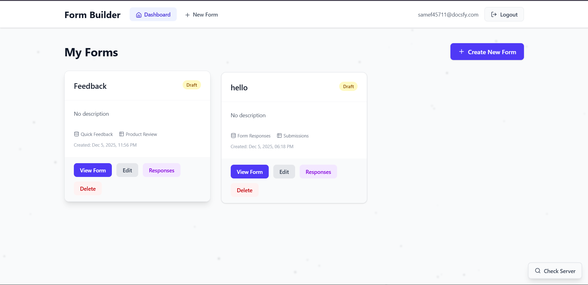
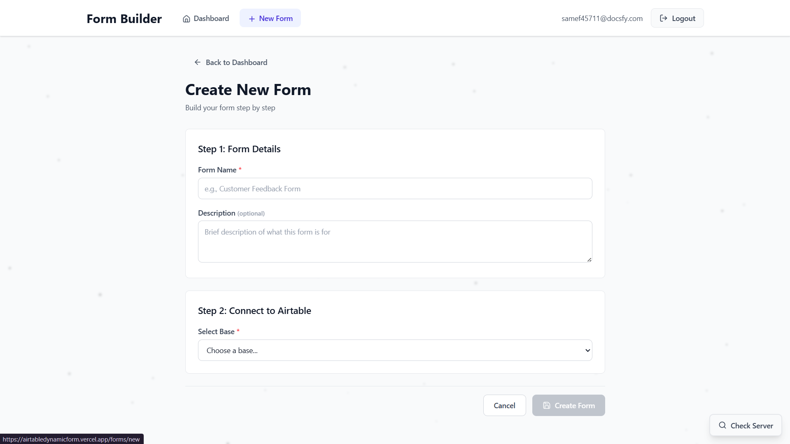
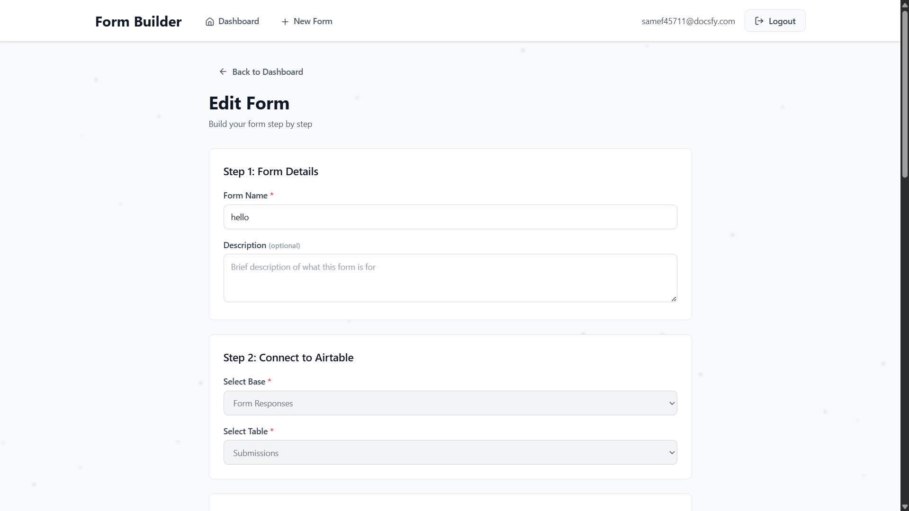
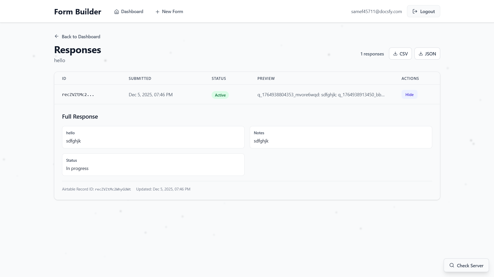
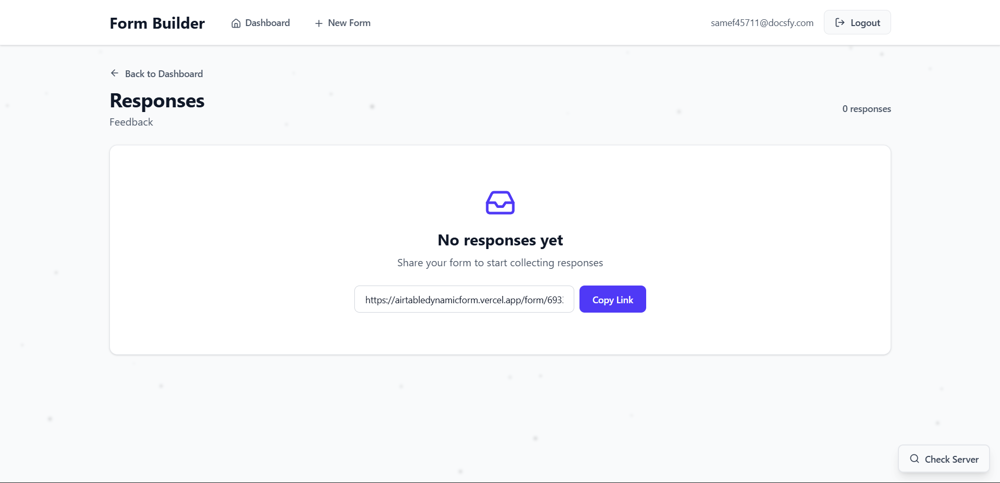

# Airtable-Connected Dynamic Form Builder

A full-stack MERN application that allows users to create dynamic forms connected to their Airtable bases, apply conditional logic to questions, and keep data synchronized using webhooks.

## Features

- **Airtable OAuth Authentication** - Secure login using Airtable OAuth 2.0 with PKCE
- **Dynamic Form Builder** - Create forms from Airtable table fields
- **Conditional Logic** - Show/hide questions based on previous answers (AND/OR logic)
- **Form Submission** - Save responses to both Airtable and MongoDB
- **Response Management** - View all form submissions with status tracking
- **Webhook Sync** - Automatic database updates when Airtable records change

## Tech Stack

- **Frontend**: React (Vite), React Router, Axios
- **Backend**: Node.js, Express.js
- **Database**: MongoDB with Mongoose
- **Authentication**: Airtable OAuth 2.0, JWT
- **API Integration**: Airtable REST API & Webhooks

## Project Structure

```
newtask/
├── client/                     # React frontend
│   ├── src/
│   │   ├── api/               # API client
│   │   ├── components/        # Reusable components
│   │   ├── context/           # Auth context
│   │   ├── pages/             # Page components
│   │   ├── styles/            # CSS styles
│   │   └── utils/             # Utility functions
│   ├── .env.example
│   └── package.json
├── server/                     # Express backend
│   ├── middleware/            # Auth middleware
│   ├── models/                # MongoDB schemas
│   ├── routes/                # API routes
│   ├── tests/                 # Unit tests
│   ├── utils/                 # Utilities
│   ├── .env.example
│   └── package.json
└── README.md
```

## Prerequisites

- Node.js 18+ and npm
- MongoDB (local or Atlas)
- Airtable account with OAuth application

## Airtable OAuth Setup

1. Go to [Airtable Developer Hub](https://airtable.com/create/oauth)
2. Create a new OAuth integration
3. Set the redirect URI to: `http://localhost:5000/api/auth/callback`
4. Request the following scopes:
   - `data.records:read`
   - `data.records:write`
   - `schema.bases:read`
   - `schema.bases:write`
   - `webhook:manage`
5. Note your Client ID and Client Secret

## Installation

### Backend Setup

```bash
cd server
npm install
cp .env.example .env
# Edit .env with your configuration
```

### Frontend Setup

```bash
cd client
npm install
cp .env.example .env
# Edit .env if needed
```

## Environment Variables

### Server (.env)

```
PORT=5000
NODE_ENV=development

# MongoDB
MONGODB_URI=mongodb://localhost:27017/airtable-form-builder

# JWT
JWT_SECRET=your-secret-key-here
JWT_EXPIRES_IN=7d

# Airtable OAuth
AIRTABLE_CLIENT_ID=your-client-id
AIRTABLE_CLIENT_SECRET=your-client-secret
AIRTABLE_REDIRECT_URI=http://localhost:5000/api/auth/callback

# Frontend URL
FRONTEND_URL=http://localhost:5173

# Webhook (for production)
WEBHOOK_SECRET=your-webhook-secret
```

### Client (.env)

```
VITE_API_URL=http://localhost:5000/api
```

## Running the Application

### Development

Start the backend:
```bash
cd server
npm run dev
```

Start the frontend:
```bash
cd client
npm run dev
```

The application will be available at:
- Frontend: http://localhost:5173
- Backend: http://localhost:5000

### Running Tests

```bash
cd server
npm test
```

## Data Models

### User
```javascript
{
  airtableUserId: String,    // Airtable user ID
  email: String,             // User email
  name: String,              // Display name
  accessToken: String,       // OAuth access token
  refreshToken: String,      // OAuth refresh token
  tokenExpiry: Date,         // Token expiration
  loginTimestamp: Date       // Last login time
}
```

### Form
```javascript
{
  owner: ObjectId,           // Reference to User
  name: String,              // Form name
  description: String,       // Form description
  airtableBaseId: String,    // Airtable base ID
  airtableTableId: String,   // Airtable table ID
  questions: [{
    questionKey: String,     // Unique identifier
    airtableFieldId: String, // Airtable field ID
    airtableFieldName: String,
    label: String,           // Display label
    type: String,            // Field type
    options: [String],       // For select fields
    required: Boolean,
    conditionalRules: {
      logic: 'AND' | 'OR',
      conditions: [{
        questionKey: String,
        operator: 'equals' | 'notEquals' | 'contains',
        value: Any
      }]
    }
  }]
}
```

### Response
```javascript
{
  formId: ObjectId,          // Reference to Form
  airtableRecordId: String,  // Airtable record ID
  answers: Object,           // Raw answers JSON
  status: 'active' | 'deletedInAirtable',
  createdAt: Date,
  updatedAt: Date
}
```

## Conditional Logic

The application supports conditional display of questions based on previous answers.

### Supported Operators

- `equals` - Exact match (or array contains value)
- `notEquals` - Does not match
- `contains` - String contains (case-insensitive)

### Logic Operators

- `AND` - All conditions must be true
- `OR` - At least one condition must be true

### Example

```javascript
// Show "GitHub URL" only if role equals "Engineer"
{
  logic: 'AND',
  conditions: [
    {
      questionKey: 'q_role',
      operator: 'equals',
      value: 'Engineer'
    }
  ]
}
```

## API Endpoints

### Authentication

| Method | Endpoint | Description |
|--------|----------|-------------|
| GET | `/api/auth/login` | Initiate OAuth flow |
| GET | `/api/auth/callback` | OAuth callback |
| GET | `/api/auth/me` | Get current user |
| POST | `/api/auth/logout` | Log out |

### Forms

| Method | Endpoint | Description |
|--------|----------|-------------|
| GET | `/api/forms` | List user's forms |
| POST | `/api/forms` | Create new form |
| GET | `/api/forms/:id` | Get form details |
| PUT | `/api/forms/:id` | Update form |
| DELETE | `/api/forms/:id` | Delete form |
| POST | `/api/forms/:id/submit` | Submit response |
| GET | `/api/forms/:id/responses` | List responses |
| GET | `/api/forms/:id/responses/export/json` | Export responses as JSON |
| GET | `/api/forms/:id/responses/export/csv` | Export responses as CSV |

### Airtable

| Method | Endpoint | Description |
|--------|----------|-------------|
| GET | `/api/airtable/bases` | List user's bases |
| GET | `/api/airtable/bases/:id/tables` | List tables |
| GET | `/api/airtable/bases/:id/tables/:id/fields` | Get fields |

### Webhooks

| Method | Endpoint | Description |
|--------|----------|-------------|
| POST | `/webhooks/airtable` | Receive Airtable events |

## Webhook Configuration

For production webhook sync:

1. Deploy your backend to a public URL
2. Update `BACKEND_URL` in your environment
3. Create a form and click "Setup Webhook" (or use the API)
4. The webhook will automatically sync:
   - Record updates → Updates in MongoDB
   - Record deletions → Soft delete (status: 'deletedInAirtable')

## Supported Airtable Field Types

- Short text (`singleLineText`)
- Long text (`multilineText`)
- Single select (`singleSelect`)
- Multi select (`multipleSelects`)
- Attachments (`multipleAttachments`)

Other field types are automatically filtered out.

## Deployment

### Live Demo

- **Frontend**: https://airtabledynamicform.vercel.app
- **Backend API**: https://airtabledynamicform.onrender.com

### Frontend (Vercel/Netlify)

1. Connect your GitHub repository
2. Set build command: `npm run build`
3. Set output directory: `dist`
4. Add environment variables

### Backend (Render/Railway)

1. Connect your GitHub repository
2. Set build command: `npm install`
3. Set start command: `npm start`
4. Add environment variables
5. Update `AIRTABLE_REDIRECT_URI` to your production URL

## Screenshots

### Dashboard
View all created forms with quick actions.



### Create New Form
Build your form step by step with form details and Airtable connection.



### Edit Form
Modify existing forms and configure Airtable base and table connections.



### Form Responses
View all submissions with expandable details, status tracking, and export options.




## License

ISC
